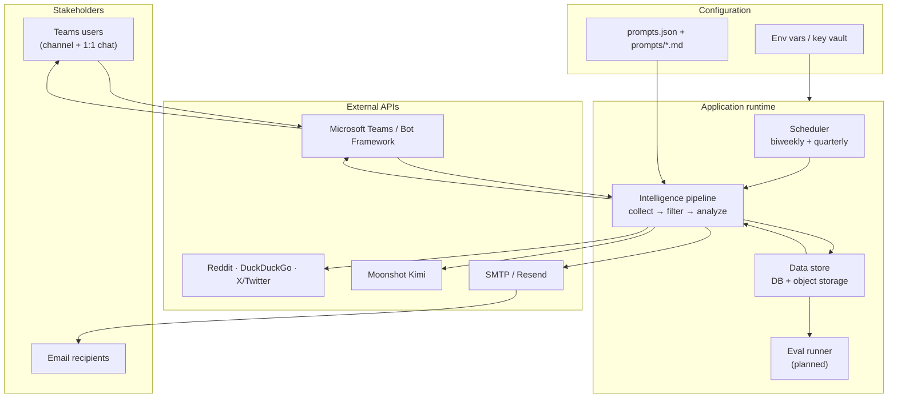
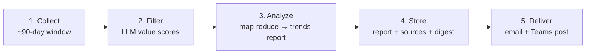
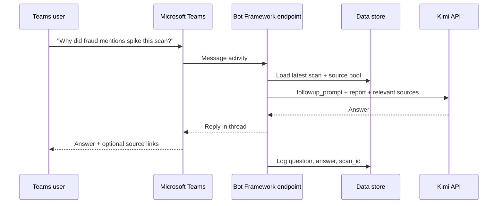

# Interac Intelligence Bot — Target Architecture

## 1. Overview

### 1.1 Purpose of this document

This document describes the **ideal end state** for the Interac Intelligence Bot: how it should be built, what each part does, and how data flows from the public web to stakeholders. It is written for onboarding and design review.

For how the code works today, see [PROJECT_SYSTEM_OVERVIEW.md](PROJECT_SYSTEM_OVERVIEW.md) and [README.md](README.md). Section 5 at the end summarizes what still needs to be built.

### 1.2 What the system does

On a fixed schedule, the service:

1. **Collects** public mentions of Interac e-Transfer and competing Canadian payment products from Reddit, news sites, forums, and X/Twitter — using keyword search and APIs, not AI-driven web browsing.
2. **Filters** low-value noise with an LLM scoring pass so only useful signal reaches analysis.
3. **Analyzes** the remaining material with focused AI calls — two parallel tracks for biweekly (chatter + market), or a map-reduce path for quarterly trends.
4. **Stores** every scan, source URL, and generated bullet in a durable data layer.
5. **Delivers** a two-column HTML email digest with footer links to the underlying data.
6. **Supports follow-up** in Microsoft Teams — users ask questions about the latest report without leaving their workspace.
7. **Evaluates** retrieval, filtering, and analysis quality over time (planned — see §3.5).

**Delivery surfaces in the target design:** email (formal digest) and Microsoft Teams (notifications + conversational Q&A).

### 1.3 Core building blocks

The system has five layers. Each layer has one job; together they form a repeatable intelligence pipeline.

| Layer | Role | Ideal implementation |
|---|---|---|
| **Scheduler** | Runs biweekly and quarterly scans on a calendar | Background job runner (cron or managed scheduler) — independent of any chat platform |
| **Collector** | Fetches and classifies raw mentions from the web | Reddit API, DuckDuckGo (web/news/X), optional dedicated X API |
| **Agent / LLM** | Scores, filters, and writes the report | Moonshot Kimi API with versioned prompt files in `prompts/` |
| **Data store** | Persists scans, sources, reports, eval results, and conversation context | Database (e.g. Postgres) + object storage for exports |
| **Delivery** | Gets the report to people | HTML email (SMTP/Resend) + Microsoft Teams bot |



The scheduler kicks off the pipeline on a timer. The pipeline talks to web sources and Kimi, writes everything to the data store, then pushes output through email and Teams. Follow-up questions read from the data store (latest report + source pool), not from process memory.

---

## 2. Technology

### 2.1 Stack overview

| Area | Technology |
|---|---|
| Language | Python 3.12 |
| Runtime | Container host (Railway, Azure, etc.) — `app.py` monolith today |
| Web collection | Reddit JSON API, DuckDuckGo (`ddgs`), optional twitterapi.io |
| LLM | Moonshot Kimi (`kimi-k2.5-preview` or later) via OpenAI-compatible chat API |
| Email | SMTP or Resend — table-based HTML, inline CSS |
| Conversational UI | Microsoft Teams via Bot Framework + `manifest.json` |
| Persistence (target) | Postgres + S3-compatible object storage |
| Config | `prompts.json`, `prompts/*.md`, environment variables / key vault |

### 2.2 Kimi vs other AI models

**Kimi** is the large language model from **Moonshot AI** (Chinese AI lab). This project calls it through Moonshot's OpenAI-compatible API (`/v1/chat/completions`), the same interface shape used by GPT-4 and many other providers.

**Why Kimi for this service:**

| Consideration | Kimi (Moonshot) | Typical alternatives (GPT-4o, Claude, Gemini) |
|---|---|---|
| **Role in this system** | Value scoring, report writing, quarterly synthesis, Teams Q&A | Could fill the same roles technically |
| **Long context** | Strong context windows — useful for quarterly map-reduce and large mention pools | Comparable on flagship tiers; costs vary |
| **Cost / throughput** | Chosen for this project's budget and batch-scan workload | Often higher per-token on premium tiers |
| **API compatibility** | Drop-in chat-completions format — minimal integration code | Native SDKs differ; swapping requires prompt retuning |
| **Factual grounding** | Instructed to cite URLs from provided text only; evals (§3.5) measure adherence | All models hallucinate without retrieval + eval guardrails |

**Important distinction:** Kimi does **not** discover posts. Keyword search and APIs collect mentions; Kimi only **scores**, **filters**, **summarizes**, and **answers questions** over text the pipeline already fetched. Collection is deterministic; AI steps are post-collection.

All Kimi calls should go through one shared gateway (e.g. `call_kimi()` in the current codebase) so timeouts, retries, token limits, and logging stay consistent. Model version is pinned via `KIMI_MODEL` env var so evals can compare runs across prompt and model changes.

### 2.3 LLM agent touchpoints

Kimi is invoked at several points — different **jobs**, same API:

| When | What it does | Prompt |
|---|---|---|
| After collection | Score mentions 1–5; drop noise | Inline value-filter prompt |
| Biweekly analysis | Write chatter column | `etransfer_chatter_prompt.md` |
| Biweekly analysis | Write market column | `market_pulse_prompt.md` |
| Quarterly (if needed) | Compress chunks, then write trends report | Inline compress + `quarterly_market_trends_prompt.md` |
| Teams follow-up | Answer user questions | `followup_prompt.md` |

### 2.4 Deployment (ideal)

```
┌─────────────────────────────────────────────────────┐
│  Container host (Railway, Azure, etc.)              │
│  ┌───────────────┐  ┌──────────────────────────┐  │
│  │  app.py       │  │  Scheduler (daily check)  │  │
│  │  pipeline +   │  │  biweekly guard · quarterly│  │
│  │  Teams bot    │  └──────────────────────────┘  │
│  └───────┬───────┘                                  │
└──────────┼──────────────────────────────────────────┘
           │
     ┌─────┴─────┬─────────────┬──────────────┬─────────┐
     ▼           ▼             ▼              ▼         ▼
  Postgres   Object storage   Kimi API    Teams / Email  Eval store
  (scans,    (exports,        (Moonshot)  (delivery +    (metrics,
   sources)    footer URLs)               follow-up)     dashboards)
```

Secrets (API keys, Teams app password, email credentials) live in environment variables or a managed vault — never in the repo.

---

## 3. Workflows and Functionality

### 3.1 How posts are collected (not AI)

Posts are found by **keyword search and public APIs**, not by an AI agent browsing the web.

| Source | Mechanism |
|---|---|
| Reddit | JSON API — subreddit search + `/new` feed browse on configured keywords |
| DuckDuckGo | Text, news, and X/Twitter searches from `etransfer_queries` and `competitor_queries` in `prompts.json` |
| X/Twitter | twitterapi.io or DDG X search when configured |

Each result is de-duplicated by URL, filtered by recency and heuristics, then classified into three buckets:

- **e-Transfer Community** — Reddit, X, forums — personal e-Transfer experiences.
- **e-Transfer News** — press and news articles.
- **Competitor Intelligence** — PayPal, Wise, KOHO, Wealthsimple, Revolut, etc.

Only **after** this deterministic collection does Kimi score mentions for insight value (see §3.2, step 2).

### 3.2 Biweekly workflow

Runs every two weeks. Produces the two-column intelligence digest stakeholders receive by email.


**Step 1 — Collect.** Queries from `prompts.json` run across Reddit, DuckDuckGo, and optional X API. Results land in the three buckets above.

**Step 2 — Filter.** Kimi scores each mention 1–5; items below threshold are dropped. Diversity floors ensure the pool is not all one platform or empty on competitor news.

**Step 3 — Analyze.** Filtered text splits into two tracks, analyzed in parallel:

| Track | Input | Prompt | Output |
|---|---|---|---|
| Chatter | e-Transfer Community only | `etransfer_chatter_prompt.md` | Left column — pain points, quotes, fraud/hold stories |
| Market Pulse | News + Competitor | `market_pulse_prompt.md` | Right column — launches, pricing, competitive moves |

Output merges into one report: scan date, both columns, and **Trend vs Last Scan** (themes vs previous run in the data store).

**Step 4 — Store.** Scan record, per-URL source rows, sent-URL history, and optional export files (see §4.1).

**Step 5 — Deliver.** HTML email (two columns) + Teams Adaptive Card in the configured channel.

### 3.3 Quarterly workflow

Complements biweekly with a **90-day trends narrative**. Fires Nov 1, Feb 1, May 1, Aug 1, or on operator request.



**Differences from biweekly:**

| Setting | Biweekly | Quarterly |
|---|---|---|
| Lookback | ~30–120 days (configurable) | ~90 days |
| URL dedupe | Skips previously sent URLs | No dedupe — full window needed for trends |
| Volume caps | Tighter | Higher |
| Output | Two-column digest | Single long-form narrative |

**Analyze step:** If the filtered pool fits one API context window, one Kimi call writes the report. Otherwise **map-reduce**: compress ~3k-char chunks in parallel → merge evidence digest → final Kimi call with `quarterly_market_trends_prompt.md`.

Quarterly does not replace biweekly — it zooms out while biweekly catches fresh signal.

### 3.4 Microsoft Teams integration

Teams is the conversational interface: scan notifications and follow-up Q&A.

**Components:**

| Piece | Role |
|---|---|
| `manifest.json` | Registers the bot with Microsoft 365 — name, icon, scopes |
| Bot Framework endpoint | HTTPS webhook; receives messages from Teams |
| Azure Bot registration | App ID + secret connecting Teams client to backend |
| Adaptive Cards | Rich channel posts — scan date, summary, action buttons |

**On scan complete:** report saved → email sent → Adaptive Card posted to e.g. `#interac-intelligence` with **View full report** and **Ask a question** actions.

**Follow-up conversation:**



Users ask in natural language. The model sees the latest report, a sample of stored source mentions, and the question (`followup_prompt.md`). Rate limits and conversation history are persisted in the data store.

### 3.5 Evals (planned)

No eval system exists in the codebase today. The target architecture includes **automated evaluations** to measure whether the pipeline is retrieving the right material, filtering wisely, and writing accurate reports.

**Goals:**

| Stage | What to measure | Example question |
|---|---|---|
| **Retrieval** | Did we find posts we should have found? | "Was this known Reddit thread in the mention pool?" |
| **Filtering** | Did we keep signal and drop noise? | "Should this mention have scored ≥3?" |
| **Analysis** | Are bullets faithful to sources? | "Does this quote appear in the linked URL's text?" |
| **End-to-end** | Is the digest useful to stakeholders? | "Does this bullet match human reviewer judgment?" |

**Assumed design:**

```
┌─────────────────────────────────────────────────────────┐
│  Eval suite (runs after each scan or on a schedule)     │
│                                                         │
│  1. Golden set     — curated URLs + expected labels     │
│  2. Auto-checks    — URL resolvable, quote ⊆ snippet    │
│  3. LLM-as-judge   — rubric-scored faithfulness (Kimi   │
│                       or second model for cross-check)  │
│  4. Human review   — periodic sample audit in dashboard │
└─────────────────────────────────────────────────────────┘
         │
         ▼
   eval_results table  →  dashboard / alerts on regression
```

**Golden set (retrieval).** Maintain ~50–100 labeled examples: URLs or query patterns with tags (`should_find`, `should_ignore`, `chatter`, `market`, `competitor`). After each scan, check recall: what fraction of `should_find` URLs appeared in the raw pool? Track recall over time per platform.

**Filter evals.** Sample mentions Kimi dropped vs kept. Human or LLM-as-judge labels a batch monthly; compare to Kimi scores. Metrics: precision/recall at threshold 3, false-negative rate on high-signal posts.

**Analysis faithfulness.** For each report bullet that cites a URL:

- **Structural:** URL present, domain matches platform badge, date not invented.
- **Quote check:** Extract quoted text; verify substring match against stored snippet or fetched page text.
- **LLM-as-judge:** Pass bullet + source snippet to a separate prompt: "Is this bullet supported by the source? (yes/no/partial)." Flag partial/no for human review.

**End-to-end rubric.** Monthly, reviewers score 10 random bullets on 1–5 for relevance, accuracy, and actionability. Store scores in `eval_results`; alert if rolling average drops >0.5 vs prior month.

**Storage (extends §4.1):**

```
eval_runs
  └── id, scan_id, ran_at, suite_version, overall_score

eval_results
  └── eval_run_id, check_type, target_id (source_id or bullet_id),
      passed (bool), score, details_json, reviewer (auto | human)
```

**Operational hooks:**

- Run lightweight auto-checks after every scan (URL validity, bullet-has-source).
- Run full golden-set + LLM-judge suite weekly.
- Block prompt/model deploys if regression exceeds threshold (e.g. faithfulness < 90%).
- Include eval summary line in email footer: `Quality checks: 47/50 passed · last full eval 12 Jun 2026`.

---

## 4. Data Storage and Integrity

### 4.1 Data store (ideal design)

All durable data lives in a proper store so the system survives redeploys, supports multiple instances, and answers "where did this bullet come from?" months later.

```
scans
  └── id, type (biweekly | quarterly), ran_at, report_text, themes,
      prompt_version, model_version

sources
  └── scan_id, url, platform, title, snippet, published_at,
      included_in_chatter, included_in_market,
      chatter_bullet_text, market_bullet_text,
      kimi_value_score

conversations
  └── user_id, scan_id, question, answer, created_at

exports
  └── scan_id, file_url, generated_at

eval_runs / eval_results
  └── see §3.5
```

**Why this matters:**

- **Traceability** — Every email bullet traces to a stored URL and snippet.
- **Follow-up context** — Teams Q&A loads from the DB, not ephemeral runtime state.
- **Trend detection** — "Trend vs Last Scan" compares theme labels across scan records.
- **Integrity** — Evals and footers both read the same source-of-truth tables.

### 4.2 Email footers

Every biweekly and quarterly email ends with a **data footer** so recipients can verify and explore the evidence.

| Footer element | Purpose |
|---|---|
| Scan metadata | Date, report type, run ID |
| Source index link | Browsable list of every URL in this scan, with inclusion flags |
| Ledger download | Excel/CSV export of all sources |
| Mention pool download | Filtered pool sent to Kimi |
| Archive link | Historical scans |
| Methodology note | Platforms searched, prompt version, model version |
| Eval summary (planned) | Latest quality-check pass rate |

Example (conceptual):

```
─────────────────────────────────────────
Data & sources for this scan (14 Jun 2026, biweekly #47)
  View all sources:      https://data.example.com/scans/47/sources
  Download ledger:       https://storage.example.com/exports/scan-47-ledger.xlsx
  Download mention pool: https://storage.example.com/exports/scan-47-pool.xlsx
  Archive:               https://data.example.com/scans
  Searched: Reddit, DDG (web/news/X) · Prompts v2026-06 · Kimi k2.5
  Quality checks:        47/50 passed (full eval 12 Jun 2026)
─────────────────────────────────────────
```

Body bullets link to source domains where possible; the footer is the **index to everything**.

### 4.3 Object storage and exports

Large exports (`source_ledger.xlsx`, mention pools) are **artifacts of** the database — generated after each scan, uploaded to S3-compatible storage with stable URLs referenced in email footers. Spreadsheets supplement the DB; they do not replace it.

---

## 5. Current vs Future State

This document is the **north star**. The table below maps target capabilities to what the repository implements today.

| Target (this document) | Current code |
|---|---|
| Postgres (or similar) data store | In-memory vars + `state/*.json` + Excel on disk |
| Microsoft Teams for delivery + Q&A | **Telegram bot** — commands, scheduled broadcasts, plain-text follow-up |
| Email footer with source index links | Footer with optional S3 workbook links only |
| Scheduler independent of chat platform | Job queue inside Telegram `Application` |
| Automated eval suite (§3.5) | Not built |
| `manifest.json` Teams app wired to runtime | Scaffold exists; not connected to live pipeline |

**Telegram today:** The running app uses `python-telegram-bot` for `/scan`, `/subscribe`, scheduled biweekly posts to subscribed chats, and follow-up Q&A via plain-text messages. That is a development and operations convenience, not the long-term delivery model.

Use [PROJECT_SYSTEM_OVERVIEW.md](PROJECT_SYSTEM_OVERVIEW.md) and [README.md](README.md) for day-to-day operation of the code as it exists now.
