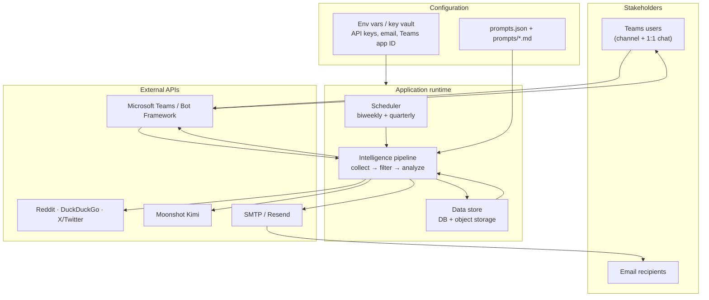
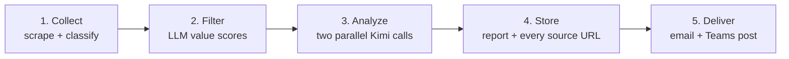
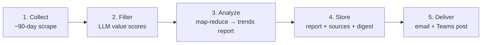
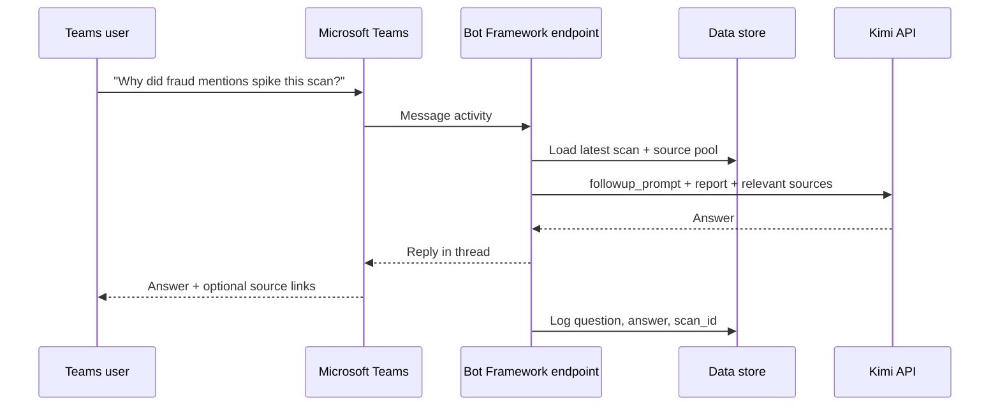

# Interac Intelligence Bot — Target Architecture

This document describes the **ideal end state** for the system: how it should be built, what each part does, and how data flows from the public web to stakeholders. It is written for onboarding and design review.

For how the code works **today** (Telegram bot, in-memory state, optional S3 workbook links), see [PROJECT_SYSTEM_OVERVIEW.md](PROJECT_SYSTEM_OVERVIEW.md).

---

## What this system does

On a fixed schedule, the bot:

1. **Collects** public mentions of Interac e-Transfer and competing Canadian payment products from Reddit, news sites, forums, and X/Twitter.
2. **Filters** low-value noise with an LLM scoring pass so only useful signal reaches analysis.
3. **Analyzes** the remaining material with two focused AI calls — one for user chatter (pain points, fraud, delays) and one for market intelligence (competitor launches, pricing, ecosystem news).
4. **Stores** every scan, source URL, and generated bullet in a durable data layer so nothing is lost on redeploy and follow-up questions have full context.
5. **Delivers** a two-column HTML email digest to stakeholders, with footer links to the underlying data.
6. **Supports follow-up** in Microsoft Teams — users can ask questions about the latest report without leaving their workspace.

There is no Telegram interface in the target design. Teams is the conversational surface; email is the formal digest.

---

## Core building blocks

The system has five layers. Each layer has one job; together they form a repeatable intelligence pipeline.

| Layer | Role | Ideal implementation |
|---|---|---|
| **Scheduler** | Runs biweekly and quarterly scans on a calendar | Background job runner (e.g. cron on the host, or a managed scheduler) — not tied to a chat platform |
| **Collector** | Fetches and classifies raw mentions from the web | Reddit API, DuckDuckGo (web/news/X), optional dedicated X API |
| **Agent / LLM** | Scores, filters, and writes the report | Moonshot Kimi API with versioned prompt files in `prompts/` |
| **Data store** | Persists scans, sources, reports, and conversation context | Database (e.g. Postgres) + object storage for exports; replaces in-memory state and ad-hoc Excel files |
| **Delivery** | Gets the report to people | HTML email (SMTP/Resend) + Microsoft Teams bot for notifications and Q&A |



**How to read this diagram.** The scheduler kicks off the pipeline on a timer. The pipeline talks to web sources and Kimi, writes everything to the data store, then pushes output through email and Teams. Teams users can send messages back into the pipeline for follow-up questions; those reads also come from the data store (latest report + source pool), not from fragile in-memory variables.

---

## The biweekly workflow (main loop)

This is the heart of the system. It runs every two weeks and produces the intelligence digest most stakeholders care about.



### Step 1 — Collect

The collector searches configured queries from `prompts.json` across Reddit subreddits, DuckDuckGo (general web, news, and X/Twitter), and optionally a dedicated X API. Each result is de-duplicated by URL and sorted into three buckets:

- **e-Transfer Community** — real people on Reddit, X, or forums talking about personal e-Transfer experiences.
- **e-Transfer News** — press releases and news articles about Interac or e-Transfer.
- **Competitor Intelligence** — mentions of PayPal, Wise, KOHO, Wealthsimple, Revolut, and similar products.

This classification matters because the two analysis tracks in step 3 only see the text that belongs to them.

### Step 2 — Filter (first agent pass)

Before any report writing happens, Kimi scores each mention on insight value (typically 1–5). Mentions below the threshold are dropped. This step runs in parallel across the three buckets and is what prevents generic or off-topic posts from polluting the digest.

After scoring, simple **diversity floors** ensure the pool is not dominated by a single platform (e.g. all Reddit, no X) or empty on competitor news.

### Step 3 — Analyze (second agent pass)

Filtered mentions are split into two text blocks:

| Track | Input | Prompt file | Output column |
|---|---|---|---|
| **Chatter** | e-Transfer Community only | `etransfer_chatter_prompt.md` | Left column — user pain points, quotes, fraud/hold/limit stories |
| **Market Pulse** | e-Transfer News + Competitor Intelligence | `market_pulse_prompt.md` | Right column — product launches, pricing, competitive moves |

Both Kimi calls run **in parallel**. The results are merged into one report with a scan date, both columns, and a short **Trend vs Last Scan** section (themes that persisted, went quiet, or appeared for the first time — compared against the previous run in the data store).

### Step 4 — Store

Every successful scan writes to the data store. At minimum:

| What | Why |
|---|---|
| **Scan record** | Scan date, report text, theme labels |
| **Source records** | One row per URL: title, snippet, platform, publish date, which report bullets cited it |
| **Sent-URL history** | URLs already surfaced in past scans, so future runs prioritize fresh signal |
| **Export files** | Optional Excel/CSV snapshots in object storage for analysts who want spreadsheets |

The data store is the **single source of truth**. Follow-up questions, email footers, and audit trails all read from here — not from process memory that disappears when the server restarts.

### Step 5 — Deliver

- **Email** — HTML two-column digest (e-Transfer Chatter left, Payments Landscape right). See [Email footers](#email-footers) below.
- **Teams** — Adaptive Card or rich message posted to a configured team channel summarizing the scan, with a link to open a threaded follow-up in the bot.

---

## The quarterly workflow

Quarterly runs complement the biweekly digest with a **trends-level narrative** — what shifted across the Canadian payments landscape over roughly the last 90 days. They fire on a fixed calendar (Nov 1, Feb 1, May 1, Aug 1) or on demand by an operator.

The pipeline reuses the same collector and filter as biweekly, but widens the time window and ends in a single long-form report instead of two columns.



### Step 1 — Collect (wider window)

The collector runs the same queries and platforms as biweekly, but with important differences:

| Setting | Biweekly | Quarterly |
|---|---|---|
| Lookback | ~30–120 days (configurable) | ~90 days |
| URL dedupe | Skips URLs already sent in past biweekly scans | **No dedupe** — full history in the window is needed for trends |
| Volume caps | Tighter per-section limits | Higher caps to build a richer pool |

All three buckets (community, news, competitor) are still populated and classified the same way.

### Step 2 — Filter (first agent pass)

The same Kimi value-scoring pass runs here. Quarterly needs quality control even more than biweekly — a 90-day pool is larger, so dropping noise before analysis keeps token costs and hallucination risk manageable.

### Step 3 — Analyze (map-reduce when needed)

Unlike biweekly’s two parallel column writers, quarterly produces **one narrative report** using `quarterly_market_trends_prompt.md`. The analyze step picks a path based on how much text survived filtering:

**Fast path** — if the filtered scrape fits in a single API context window, one Kimi call writes the full trends report directly from the raw mentions.

**Map-reduce path** — if the scrape is too large (typical for a full quarter):

1. **Map** — split the text into ~3,000-character chunks; run a compress call on each chunk in parallel (up to 3 at a time). Each compress call extracts evidence bullets with source URLs — no invented facts.
2. **Merge** — concatenate the chunk digests into one evidence document (truncating the middle only if the merged digest still exceeds the context budget).
3. **Reduce** — one final Kimi call reads the merged digest and writes the quarterly trends narrative.

The output is a single long-form report (not a two-column layout) covering retail vs commercial signals, competitor moves, and recurring themes across the quarter.

### Step 4 — Store

Quarterly scans are stored alongside biweekly runs in the data store, tagged `type: quarterly`:

| What | Why |
|---|---|
| **Scan record** | Report text, scan date, run ID |
| **Source records** | Every URL in the pool, with flags for inclusion in the final report |
| **Compress digest** | The merged evidence document from the map step (when map-reduce was used) — lets auditors see what the final model actually read |
| **Export files** | Quarterly ledger and mention-pool downloads in object storage |

### Step 5 — Deliver

- **Email** — long-form HTML report (single-column narrative layout) with the same [data footer](#email-footers) pattern: source index link, ledger download, archive link.
- **Teams** — Adaptive Card announcing the quarterly report is ready, with a summary line and a link to read the full report or ask follow-up questions in the bot.

Quarterly does **not** replace the biweekly digest. Biweekly catches fresh signal every two weeks; quarterly zooms out to show what persisted, accelerated, or faded over the quarter.

---

## Data store (ideal design)

Today, much of the runtime state lives in memory and some audit data is written to local Excel files. In the target architecture, **all durable data lives in a proper store** so the system survives redeploys, supports multiple instances, and can answer “where did this bullet come from?” months later.

### What gets persisted

```
scans
  └── id, type (biweekly | quarterly), ran_at, report_text, themes

sources
  └── scan_id, url, platform, title, snippet, published_at,
      included_in_chatter (yes/no), included_in_market (yes/no),
      chatter_bullet_text, market_bullet_text

conversations  (Teams follow-up)
  └── user_id, scan_id, question, answer, created_at

exports
  └── scan_id, file_url (object storage), generated_at
```

### Why this matters

- **Traceability** — Every quote in the email can be traced back to a stored URL and original snippet.
- **Follow-up context** — Teams Q&A loads the latest scan and relevant sources from the DB, not a variable that was set during the last manual `/scan`.
- **Trend detection** — “Trend vs Last Scan” compares theme labels across scan records, not a JSON file that may or may not exist on disk.
- **Footer links** — Email footers point at stable URLs served from object storage or an internal data portal, backed by these tables.

### Object storage

Large exports (`source_ledger.xlsx`, full mention pools) can still be generated for power users, but they are **artifacts of** the database — uploaded to S3-compatible storage with predictable, shareable URLs — not the primary persistence mechanism.

---

## Email footers

Every biweekly and quarterly email should end with a **data footer** so recipients can verify and explore the evidence behind the digest. In the ideal state, the footer includes:

| Footer element | Purpose |
|---|---|
| **Scan metadata** | Scan date, report type (biweekly / quarterly), run ID |
| **Source index link** | Link to a browsable list of every URL considered in this scan, with inclusion flags |
| **Full source ledger download** | Link to Excel/CSV export of all sources for this run |
| **Mention pool download** | Link to the raw filtered mention pool that was sent to Kimi |
| **Data portal / archive link** | Link to the internal page or bucket prefix where historical scans are stored |
| **Methodology note** | One line: which platforms were searched and which prompt version was used |

Example footer layout (conceptual):

```
─────────────────────────────────────────
Data & sources for this scan (14 Jun 2026, biweekly #47)
  View all sources:     https://data.example.com/scans/47/sources
  Download ledger:      https://storage.example.com/exports/scan-47-ledger.xlsx
  Download mention pool: https://storage.example.com/exports/scan-47-pool.xlsx
  Archive:              https://data.example.com/scans
  Searched: Reddit, DuckDuckGo (web/news/X) · Prompts v2026-06
─────────────────────────────────────────
```

Each bullet in the email body already links to its source domain where possible; the footer is the **index to everything**, not just the items that made the final cut.

---

## Microsoft Teams integration

Telegram is not part of the target design. **Microsoft Teams** is the conversational interface: it delivers scan notifications and accepts follow-up questions.

### Teams app components

| Piece | Role |
|---|---|
| **Teams manifest** (`manifest.json`) | Registers the bot with Microsoft 365 — app name, icon, scopes (personal, team, group chat) |
| **Bot Framework endpoint** | HTTPS webhook on the app server; receives messages and invoke activities from Teams |
| **Azure Bot registration** | Connects the Teams client to your backend via Microsoft App ID + secret |
| **Adaptive Cards** | Rich scan summaries in channel posts (title, date, top themes, “Ask a question” action) |

### Delivery in Teams

When a biweekly scan completes:

1. Pipeline saves the report to the data store.
2. Email goes out to the distribution list.
3. Bot posts an Adaptive Card to the configured Teams channel (e.g. `#interac-intelligence`) with:
   - Scan date and one-line summary
   - Buttons: **View full report** (opens tab or deep link) · **Ask a question** (opens 1:1 chat with the bot)

### Follow-up conversation

Users ask questions in natural language — no slash commands required for Q&A (admin commands like `status` can remain for operators).



**Context the model sees:** the latest report text, a sample of raw mentions from the stored source pool, and the user’s question (`followup_prompt.md`). Rate limits and conversation history are also stored — not held only in process memory.

**What Teams replaces from the old design:**

| Old (Telegram) | Target (Teams) |
|---|---|
| `/scan`, `/subscribe`, plain-text Q&A | Channel notifications + bot 1:1 chat |
| `subscribed_chats` in memory | Teams channel config + optional user allowlist in DB |
| `last_report` in memory | Latest scan row in data store |
| Chunked plain-text messages | Adaptive Cards + threaded replies |

---

## LLM agent touchpoints (summary)

Kimi is invoked at four points in the ideal pipeline. You do not need a separate diagram for each — they are different **jobs** for the same API:

| When | What it does | Prompt |
|---|---|---|
| After collection | Score mentions 1–5; drop noise | Inline scoring prompt |
| During biweekly analysis | Write chatter column | `etransfer_chatter_prompt.md` |
| During biweekly analysis | Write market column | `market_pulse_prompt.md` |
| Quarterly (if needed) | Compress chunks, then write trends report | Inline compress + `quarterly_market_trends_prompt.md` |
| Teams follow-up | Answer user questions | `followup_prompt.md` |

All calls go through one shared gateway (`call_kimi()` in the current codebase) so timeouts, retries, and token limits are handled in one place.

---

## Deployment (ideal)

```
┌─────────────────────────────────────────────────────┐
│  Container host (Railway, Azure, etc.)              │
│  ┌───────────────┐  ┌──────────────────────────┐  │
│  │  app.py       │  │  Scheduler (daily check)  │  │
│  │  pipeline +   │  │  biweekly guard · quarterly│  │
│  │  Teams bot    │  └──────────────────────────┘  │
│  └───────┬───────┘                                  │
└──────────┼──────────────────────────────────────────┘
           │
     ┌─────┴─────┬─────────────┬──────────────┐
     ▼           ▼             ▼              ▼
  Postgres   Object storage   Kimi API    Teams / Email
  (scans,    (export files,   (Moonshot)  (delivery +
   sources)    footer URLs)               follow-up)
```

Secrets (API keys, Teams app password, email credentials) live in environment variables or a managed vault — never in the repo.

---

## Gap: current codebase vs this document

The repository today still uses a **Telegram bot** as its interactive layer and keeps much state **in memory**, with Excel files on disk for audit. The `manifest.json` Teams scaffold exists but is not wired to the live runtime.

| Target (this doc) | Current code |
|---|---|
| Postgres (or similar) data store | In-memory vars + `state/*.json` + Excel |
| Teams bot for delivery + Q&A | Telegram commands and plain-text handler |
| Email footer with source index links | Footer with optional S3 workbook links only |
| Scheduler independent of chat platform | Job queue inside Telegram `Application` |

Use this document as the **north star** for refactors. Use [PROJECT_SYSTEM_OVERVIEW.md](PROJECT_SYSTEM_OVERVIEW.md) and [README.md](README.md) for day-to-day operation of the code as it exists now.
