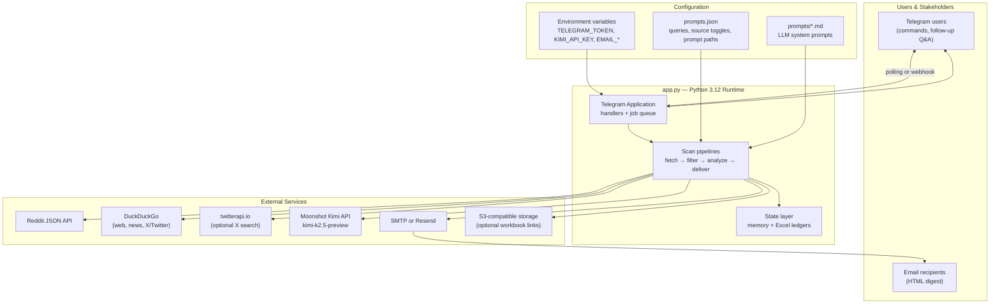
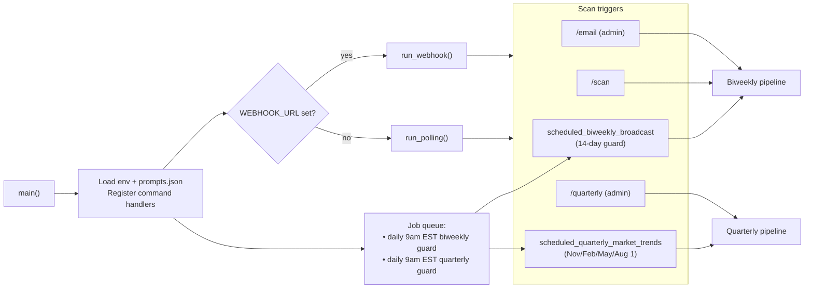
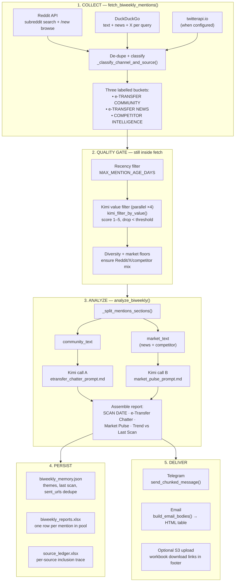
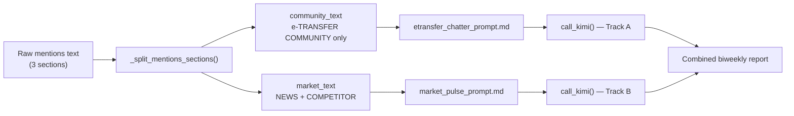
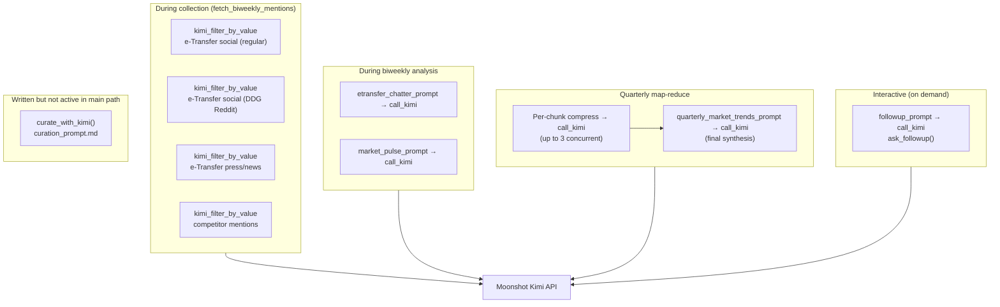
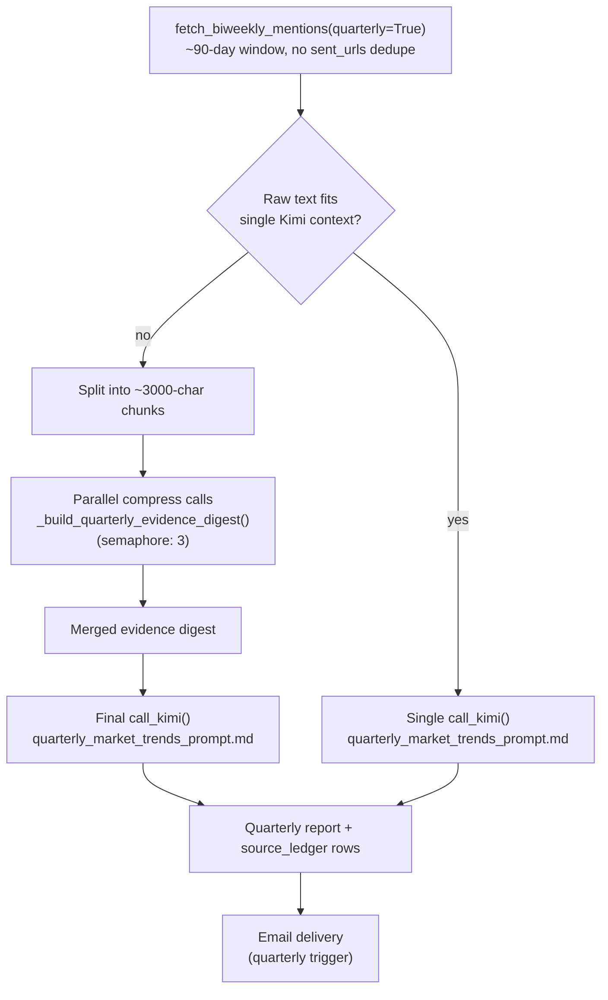
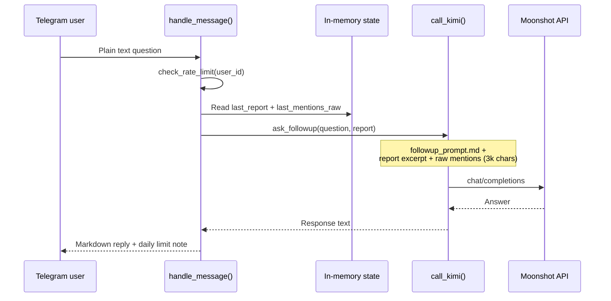
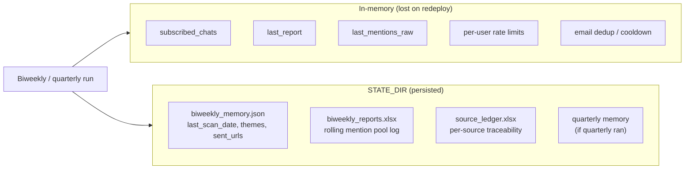
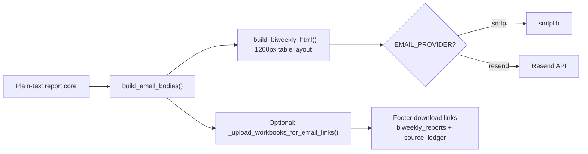
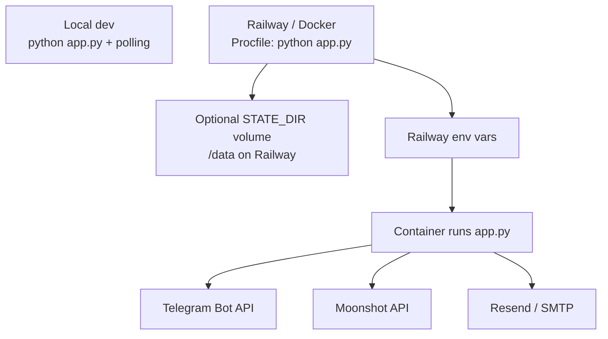

# Interac Intelligence Bot — Architecture Flow

Visual reference for how the agentic workflow system is wired. For configuration details and command lists, see [PROJECT_SYSTEM_OVERVIEW.md](PROJECT_SYSTEM_OVERVIEW.md) and [README.md](README.md).

---

## 1. System Context

Who talks to what, and where intelligence is produced.

---

## 2. Runtime Boot & Triggers

How the process starts and what kicks off a scan.

| Trigger | Entry function | Delivery |
|---|---|---|
| Scheduled biweekly (daily check, runs if ≥14 days) | `scheduled_biweekly_broadcast` | Telegram subscribers + optional email |
| `/scan` | `run_biweekly_scan` | Requesting Telegram chat |
| `/email` | `cmd_email` | Email (+ Telegram if configured) |
| Scheduled quarterly | `scheduled_quarterly_market_trends` | Email |
| `/quarterly` | `cmd_quarterly` | Requesting Telegram chat |

---

## 3. Biweekly Agentic Pipeline (Primary Workflow)

End-to-end flow from public web to two-column intelligence digest. This is the core agentic loop.

### Parallel Kimi calls in the biweekly analyze step

Both `call_kimi()` tasks are launched with `asyncio.create_task` and awaited in parallel.

---

## 4. Kimi Agent Touchpoints

Every place the LLM acts as an agent in the system.

| Agent step | Prompt file | Purpose |
|---|---|---|
| Value filter | (inline scoring prompt) | Drop low-signal mentions before analysis |
| Chatter column | `etransfer_chatter_prompt.md` | Reddit/X/forum pain points & quotes |
| Market column | `market_pulse_prompt.md` | Competitor launches, pricing, ecosystem news |
| Quarterly compress | inline system prompt | Map: chunk raw scrape into evidence bullets |
| Quarterly report | `quarterly_market_trends_prompt.md` | Reduce: long-form trends narrative |
| Follow-up Q&A | `followup_prompt.md` | Answer questions against latest report |

---

## 5. Quarterly Pipeline (Map-Reduce)

Runs on a quarterly calendar (Nov 1, Feb 1, May 1, Aug 1) or via `/quarterly`.

---

## 6. Interactive Follow-Up Flow

Plain-text Telegram messages (not commands) trigger a separate agent path.

Requires a prior successful `/scan`, scheduled run, or `/email` so `last_report` is populated.

---

## 7. State & Persistence

---

## 8. Email Rendering Path

How the biweekly report becomes the HTML digest.

Left column = e-Transfer Chatter (pain points). Right column = Payments Landscape / Market Pulse.

---

## 9. Component Map

| Layer | Key module / file | Responsibility |
|---|---|---|
| Entry | `main()` in `app.py` | Boot Telegram app, register handlers & jobs |
| Config | `prompts.json`, env vars | Search queries, prompt paths, API keys |
| Collection | `fetch_biweekly_mentions()` | Reddit + DDG + Twitter, classify, filter |
| LLM gateway | `call_kimi()` | All Moonshot API calls (shared HTTP client) |
| Value filter | `kimi_filter_by_value()` | Pre-analysis mention scoring |
| Biweekly analysis | `analyze_biweekly()` | Dual-track parallel synthesis |
| Quarterly analysis | `analyze_quarterly()` | Map-reduce for long context |
| Delivery | `send_email()`, `send_chunked_message()` | Email HTML + Telegram chunks |
| Scheduling | `scheduled_biweekly_broadcast`, `scheduled_quarterly_market_trends` | Autonomous cadence |
| Audit trail | `_append_source_ledger()`, `_append_biweekly_pool_excel()` | Excel evidence logs |

---

## 10. Deployment Topology

---

*Generated to complement the prose docs. Diagrams reflect `app.py` as of the current repository state.*
